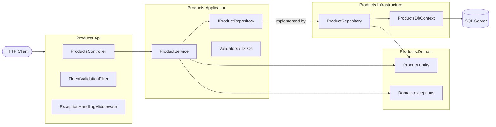
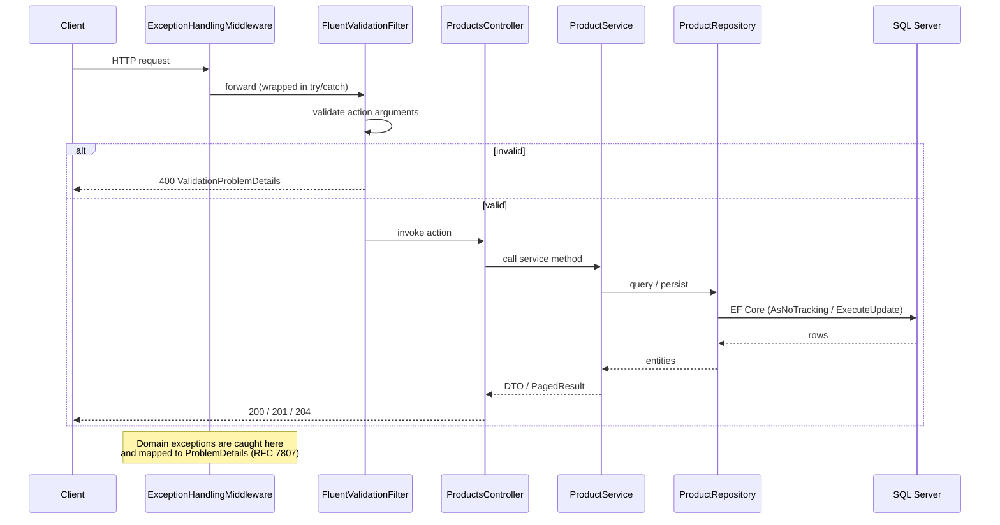

# Products API

[](https://github.com/jorgempsilva/Products/actions/workflows/ci.yml)
[](https://github.com/jorgempsilva/Products/actions/workflows/codeql.yml)
[](https://dotnet.microsoft.com/)

RESTful API for managing products, built with ASP.NET Core (.NET 10), EF Core (code-first) and SQL Server LocalDB, following a layered architecture inspired by Clean Architecture (dependencies point inward toward the domain). The domain is intentionally kept lightweight for the scope of this API — business logic is orchestrated in the Application layer rather than in rich domain entities.

## Solution Structure

- `src/Products.Domain` — entities and domain exceptions (no dependencies)
- `src/Products.Application` — DTOs, service interfaces/implementation, FluentValidation validators
- `src/Products.Infrastructure` — EF Core DbContext, repository, migrations, seeding
- `src/Products.Api` — controllers, exception middleware, DI composition root
- `tests/Products.UnitTests` — xUnit + NSubstitute + FluentAssertions (46 tests)
- `tests/Products.IntegrationTests` — WebApplicationFactory against LocalDB (26 tests)

Dependency direction: Api -> Application <- Infrastructure, Application -> Domain. The Application layer defines `IProductRepository`; Infrastructure implements it. Controllers are thin — all business logic lives in `ProductService`.

## Architecture & Request Flow

### Layers (Clean Architecture)

Dependencies always point inward — `Domain` has no dependencies, and both `Api` and `Infrastructure` depend on the `Application` abstractions.



### Request pipeline

Every request flows through validation and centralized exception handling before reaching the database.



## Endpoints (9)

| Method | Route | Description |
|--------|-------|-------------|
| GET    | `/api/products` | List all products, paginated (stock included) |
| POST   | `/api/products` | Create a product (201 + Location header) |
| GET    | `/api/products/{id}` | Get a product by id |
| PUT    | `/api/products/{id}` | Update a product's name, description and price (stock unchanged) |
| DELETE | `/api/products/{id}` | Delete a product (204) |
| POST   | `/api/products/{id}/decrement-stock/{quantity}` | Atomically decrement stock |
| POST   | `/api/products/{id}/add-to-stock/{quantity}` | Atomically increment stock |
| GET    | `/api/products/search?name={name}` | Partial, case-insensitive name search, paginated |
| GET    | `/api/products/stock-level?min={min}&max={max}` | Products within a stock range, paginated |

Swagger UI is available at `/swagger` in Development.

### Pagination

The collection endpoints (`GET /api/products`, `/search`, `/stock-level`) accept optional `page` and `pageSize` query parameters and return a paged envelope instead of a bare array:

| Parameter | Default | Bounds |
|-----------|---------|--------|
| `page` | 1 | `>= 1` |
| `pageSize` | 20 | `1..50` |

Out-of-bounds values return 400 ValidationProblemDetails. The response shape is:

```json
{
  "items": [ /* ProductResponse[] */ ],
  "page": 1,
  "pageSize": 20,
  "totalCount": 42,
  "totalPages": 3
}
```

## Key Architectural Decisions

### Unique 6-digit ID generation (distributed-safe)
Product IDs come from a SQL Server SEQUENCE (`ProductIdSequence`, range 100000-999999, NO CYCLE), bound via `HasDefaultValueSql("NEXT VALUE FOR ProductIdSequence")`. The database allocates each number exactly once, so multiple application instances can never generate duplicates — no application-level coordination needed.

Trade-off: the range holds 900,000 IDs. When exhausted, SQL Server raises an error surfaced as a `500` (the sequence has no more values to allocate). This is an accepted operational limit imposed by the 6-digit requirement. Sequences may produce gaps (e.g. on rollback), which is harmless for identifiers.

### Concurrency-safe stock operations
Stock changes use `ExecuteUpdateAsync` — a single atomic UPDATE where the availability check is part of the WHERE clause:

```sql
UPDATE Products SET Stock = Stock - @qty WHERE Id = @id AND Stock >= @qty
```

There is no read-modify-write window, so concurrent decrements can never oversell. When 0 rows are affected the service distinguishes not found (404) from insufficient stock (422) with a follow-up existence check. An integration test fires 20 parallel decrements against a stock of 10 and asserts exactly 10 succeed and stock ends at 0. A database CHECK constraint (`Stock >= 0`) provides defence in depth.

### Error handling — custom exceptions to ProblemDetails (RFC 7807)

| Exception | Status |
|-----------|--------|
| `ProductNotFoundException` | 404 |
| `InsufficientStockException` | 422 |
| `InvalidStockOperationException` | 400 |
| any other `DomainException` | 400 |
| unexpected exceptions | 500 (message sanitized, details logged) |

All error responses use `application/problem+json`.

Insufficient stock returns `422 Unprocessable Entity` rather than `409 Conflict`: the request is syntactically valid and targets no concurrent-edit conflict — it is a well-formed instruction the server understands but cannot fulfil because a business rule (available stock) is violated. `409` is reserved for true state conflicts (e.g. optimistic-concurrency clashes), which this operation does not model.

### Validation
FluentValidation validators run through an MVC action filter, returning 400 ValidationProblemDetails with per-field errors. Rules: Name required/max 200 chars, Description max 1000 chars, Price > 0, Stock >= 0 (on create). Pagination parameters are validated with a shared rule (`page >= 1`, `1 <= pageSize <= 50`). Route/query invariants (positive quantities, valid min/max range) are enforced in the service.

### EF Core practices
- `AsNoTracking` on all read queries
- `ExecuteUpdateAsync`/`ExecuteDeleteAsync` for set-based writes
- Fully asynchronous data access with CancellationToken propagation
- `EnableRetryOnFailure` for transient fault resilience
- Migrations + seeding applied automatically at startup in Development only

### Integration tests use real SQL Server (LocalDB or container)
The ID SEQUENCE and `ExecuteUpdateAsync` semantics are SQL Server features; an in-memory provider would not exercise the real behaviour. Each test run creates an isolated `ProductsDb_Tests_{guid}` database and drops it afterwards. By default LocalDB is used; set `TEST_DB_CONNECTION` to target any SQL Server (e.g., the containerized one).

> LocalDB is Windows-only. On Linux/macOS (or CI), set `TEST_DB_CONNECTION` to a reachable SQL Server instance — for example the Docker container described below — otherwise the integration tests cannot connect.

## Prerequisites

- .NET 10 SDK
- One of:
  - Docker or Podman (recommended — runs SQL Server in a container), or
  - SQL Server LocalDB (bundled with Visual Studio; verify with `sqllocaldb info MSSQLLocalDB`)

## Running with Docker / Podman (recommended)

The repo ships a multi-stage `Dockerfile` and a `compose.yaml` (standard Compose Specification — works with both Docker and Podman) that start SQL Server 2022 and the API together.

```powershell
cd ProductsApi
Copy-Item .env.example .env   # then edit .env and set a strong MSSQL_SA_PASSWORD
docker compose up --build     # or: podman compose up --build
```

- API: http://localhost:8080 (Swagger at `/swagger`)
- SQL Server: `localhost,1433` (user `sa`, password from `.env`)
- The API waits for the DB healthcheck, then applies migrations and seeds 6 sample products.
- Data persists in the named volume `mssql-data`; remove everything with `docker compose down -v`.

### Security notes

- The API image runs as a **non-root user** (`$APP_UID` from the official .NET images); SQL Server 2022 also runs as the non-root `mssql` user.
- The SA password is provided via environment variable from `.env`, which is **git-ignored** (only `.env.example` is committed).
- **Podman** works with the same files and adds defense in depth: it is daemonless and can run fully **rootless**, so a container escape does not yield host root privileges.

## Running Locally (without containers)

```powershell
cd ProductsApi
dotnet run --project src/Products.Api
```

On first run (Development) the database `ProductsDb` is created, migrated and seeded with 6 sample products automatically. Browse to the shown localhost URL + `/swagger`.

### Local credentials via User Secrets

`appsettings.json` deliberately contains **no credentials**. For local runs/debugging the connection string comes from .NET User Secrets (loaded only in Development, stored outside the repo). One-time setup:

```powershell
cd src/Products.Api
dotnet user-secrets set "ConnectionStrings:ProductsDb" "Server=localhost,1433;Database=ProductsDb;User Id=sa;Password=<your .env password>;TrustServerCertificate=True;MultipleActiveResultSets=true"
```

Requires the DB container running (`docker compose up -d db`). To use LocalDB instead, set the LocalDB string documented in `appsettings.json`. In containers, compose injects the connection string via the `ConnectionStrings__ProductsDb` environment variable (env vars take precedence over user secrets).

> **Troubleshooting — connection timeout (`localhost` vs `127.0.0.1`):** If startup fails with a `SqlException` ("The server was not found or was not accessible ... timeout expired"), your machine is likely resolving `localhost` to IPv6 (`::1`) first, while the DB container only binds IPv4 (`127.0.0.1:1433`). Replace `localhost` with `127.0.0.1` in the connection string to force IPv4:
>
> ```powershell
> dotnet user-secrets set "ConnectionStrings:ProductsDb" "Server=127.0.0.1,1433;Database=ProductsDb;User Id=sa;Password=<your .env password>;TrustServerCertificate=True;MultipleActiveResultSets=true"
> ```

### Managing migrations manually

```powershell
dotnet tool install --global dotnet-ef
dotnet ef database update --project src/Products.Infrastructure --startup-project src/Products.Api
dotnet ef migrations add <Name> --project src/Products.Infrastructure --startup-project src/Products.Api --output-dir Persistence/Migrations
```

## Running Tests

```powershell
dotnet test                                  # all 72 tests
dotnet test tests/Products.UnitTests         # unit tests only (no DB needed)
dotnet test tests/Products.IntegrationTests  # requires LocalDB (default) or TEST_DB_CONNECTION
```

### Running integration tests against the containerized SQL Server

Integration tests use LocalDB by default. On machines without LocalDB (or to test against the container), set `TEST_DB_CONNECTION` — the test factory keeps the per-run isolated database name, only the server/credentials are taken from the variable:

```powershell
docker compose up -d db   # DB container only
$env:TEST_DB_CONNECTION = "Server=localhost,1433;User Id=sa;Password=<your .env password>;TrustServerCertificate=True;MultipleActiveResultSets=true"
dotnet test tests/Products.IntegrationTests
Remove-Item Env:TEST_DB_CONNECTION
```

### Running tests fully in containers

The compose file defines a `tests` service (behind the `test` profile, so a normal `up` never starts it). It builds the `test` stage of the Dockerfile and runs all 72 tests (unit + integration) inside the compose network against the `db` service:

```powershell
docker compose --profile test run --rm tests   # or: podman compose --profile test run --rm tests
```

No .NET SDK or LocalDB needed on the host — only the container runtime. Each run creates isolated `ProductsDb_Tests_{guid}` databases in the `db` container and drops them afterwards.

## Assumptions

- Stock quantities in the increment/decrement endpoints must be positive integers (quantity <= 0 returns 400).
- Stock is only mutable through the dedicated increment/decrement endpoints; `PUT /api/products/{id}` never changes stock, avoiding lost updates from concurrent stock operations.
- `stock-level` defaults: min=0, max=int.MaxValue; min > max or negative values return 400.
- Name search requires a non-empty `name` query parameter (missing returns 400).
- Collection endpoints are paginated: `page` defaults to 1 (`>= 1`), `pageSize` defaults to 20 (capped at 50); out-of-bounds values return 400.
- Timestamps are UTC; `UpdatedAtUtc` is null until the first update.

## License

This project is licensed under the [MIT License](LICENSE).
